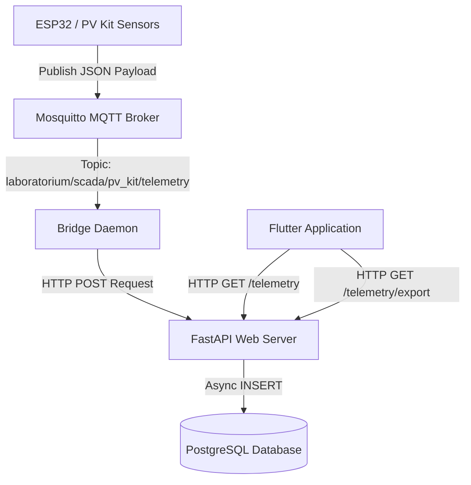

# HELIOSCADA Backend Services

[](https://fastapi.tiangolo.com/)
[](https://www.postgresql.org/)
[](https://mqtt.org/)
[](https://www.docker.com/)
[](https://www.python.org/)
[](https://github.com/astral-sh/uv)
[](https://docs.pytest.org/)

HELIOSCADA Backend Services is the core software infrastructure for the solar energy lab module. It provides real-time telemetry logging, downsampling for optimized frontend charting, CSV export data streaming, and an asynchronous bridge daemon linking IoT hardware modules with the REST API.

---

## 🏗️ Architecture & Data Flow



1. **IoT Sensors (ESP32)** publish telemetry data as JSON payloads to the MQTT Broker.
2. **Bridge Daemon** subscribes to the MQTT Broker, converts incoming payload formats, and pushes them to the FastAPI ingestion endpoint.
3. **FastAPI Web Server** runs async database queries to record data in **PostgreSQL**.
4. **FastAPI REST API** serves the Flutter application with downsampled history logs and downloadable CSV exports.

---

## 🛠️ Tech Stack & Key Features

*   **FastAPI & Python 3.13**: Built on high-performance ASGI server (`uvicorn`) utilizing asynchronous programming.
*   **SQLAlchemy 2.0 (Async)**: Asynchronous ORM interaction with PostgreSQL.
*   **Paho-MQTT v2**: Async-friendly, thread-safe queuing bridge daemon.
*   **Systematic Downsampling**: Intelligent server-side downsampling (K-th record selector) to optimize charts and reduce frontend memory footprints.
*   **Dynamic Component Filtering**: Endpoint query mapping allows clients to fetch specific telemetry datasets (`pv`, `battery`, `inverter`, or `relay`) without loading full objects.
*   **Memory-Efficient CSV Streaming**: Uses async generators to stream large telemetry datasets directly to clients without buffering them in RAM.
*   **Pytest Suite**: Complete unit testing with 85%+ coverage utilizing SQLite in-memory databases.

---

## 🚀 Quick Start (Docker Compose)

The easiest way to boot the entire ecosystem is using Docker Compose. It automatically sets up and configures **PostgreSQL, Mosquitto MQTT, FastAPI,** and the **Bridge Daemon**.

### 1. Copy Environment Configuration
Before starting, create your environment configuration:
```bash
cp .env.example .env
```
*(By default, `.env` inside Docker will resolve hostnames dynamically via service names defined in `docker-compose.yml`)*

### 2. Boot Services
Run the command below to build images and spin up containers in detached mode:
```bash
docker compose up --build -d
```

### 3. Verify Health Check
Ensure all services are running and check the API health status:
```bash
curl -s http://localhost:8000/health
```
**Expected Output:**
```json
{"status":"healthy","database":"connected","timestamp":"2026-06-15T03:33:03.255257Z"}
```

---

## 💻 Local Development Setup

If you wish to run services locally (outside Docker) for debugging or development, follow the guide below.

### Prerequisites
*   Python `>= 3.13`
*   `uv` Package Manager (recommended, see [astral.sh/uv](https://astral.sh/uv))

### 1. Install Dependencies
Sync and build the local virtual environment:
```bash
uv sync
```

### 2. Run the PostgreSQL & Mosquitto Containers
Keep the database and broker running in docker while launching services locally:
```bash
docker compose up -d db mosquitto
```

### 3. Run FastAPI Web Server
Start Uvicorn with hot-reload enabled:
```bash
uv run uvicorn src.backend.app.main:app --reload --port 8000
```
*   **Swagger API UI:** [http://localhost:8000/docs](http://localhost:8000/docs)
*   **Redoc Alternative Documentation:** [http://localhost:8000/redoc](http://localhost:8000/redoc)

### 4. Run MQTT Bridge Daemon
Launch the daemon in another terminal to forward MQTT topics to the API:
```bash
uv run python src/backend/bridge/main.py
```

---

## 🧪 Testing and Simulation

We provide a set of tools to test database logic, simulate ESP32 IoT sensors, and run regression tests.

### 1. Running Unit Tests with Pytest
Run the test suite and inspect the code coverage metrics:
```bash
PYTHONPATH=. uv run pytest --cov=src
```

### 2. Simulating Real-time Telemetry Data
We created a simulator that publishes mock telemetry data to the Mosquitto Broker every 2 seconds. Running this allows you to see the database populate in real-time.
```bash
uv run python tests/dummy_publisher.py
```

---

## 📡 API Reference Guide

### 1. Ingestion Status
*   **`GET /health`**
    *   Verifies connection health of the web server and PostgreSQL.
    *   Returns `200 OK` or `503 Service Unavailable`.

### 2. Log Telemetry
*   **`POST /api/v1/telemetry`**
    *   Used by the Bridge Daemon (or IoT devices) to ingest a log.
    *   *Payload structure:*
        ```json
        {
          "timestamp": "2026-06-15T03:32:00Z",
          "pv": { "v": 17.5, "i": 1.6, "p": 28.0, "t": 42.1 },
          "battery": { "v": 13.6, "i": 1.2, "p": 16.32, "soc": 84.5, "soc_status": "Coulomb Counting", "t": 28.4 },
          "inverter": { "v_ac": 220.0, "i_ac": 0.07, "p_ac": 15.4, "eff": 94.4 },
          "relay": { "fan": false, "lamp": true }
        }
        ```

### 3. Retrieve History Logs
*   **`GET /api/v1/telemetry`**
    *   Returns historical telemetry logs for a given time window.
    *   *Query Parameters:*
        *   `start_time` (string, ISO Format, required)
        *   `end_time` (string, ISO Format, required)
        *   `component` (`all` | `pv` | `battery` | `inverter` | `relay` - defaults to `all`)
        *   `downsample_limit` (integer, defaults to `100`)

### 4. Export Telemetry to CSV
*   **`GET /api/v1/telemetry/export`**
    *   Streams a file containing historical data formatted as a standard CSV.
    *   *Query Parameters:*
        *   `start_time` (string, ISO Format, required)
        *   `end_time` (string, ISO Format, required)

---

## 📱 Flutter Application Integration

For connecting and testing a Flutter application with this backend running on the same host machine, use the configuration guidelines below:

### 1. Host Resolution & Parameters

Depending on whether you are running the app on a physical device, Android emulator, or iOS simulator, the connection host URL will vary:

| Client Platform | Backend URL Configuration | MQTT Broker Host | MQTT Port | MQTT Root Topic |
| :--- | :--- | :--- | :--- | :--- |
| **Android Emulator** | `http://10.0.2.2:8000` | `10.0.2.2` | `1883` | `laboratorium/scada/pv_kit` |
| **iOS Simulator** | `http://localhost:8000` | `localhost` | `1883` | `laboratorium/scada/pv_kit` |
| **Physical Device (WiFi)** | `http://<YOUR_LOCAL_IP>:8000` | `<YOUR_LOCAL_IP>` | `1883` | `laboratorium/scada/pv_kit` |

> [!NOTE]
> Android Emulator runs inside an isolated virtual machine. `127.0.0.1` refers to the emulator loopback interface itself. The host machine is mapped to the special alias **`10.0.2.2`**.

### 2. MQTT Topic Structures
The Flutter application should build full subscription and publish topics using the **MQTT Root Topic** variable combined with components:
*   **Telemetry Subscription:** `<MQTT_ROOT_TOPIC>/telemetry` 
    *   *(e.g., `laboratorium/scada/pv_kit/telemetry`)*
*   **Relay Status Subscription:** `<MQTT_ROOT_TOPIC>/status/relay`
    *   *(e.g., `laboratorium/scada/pv_kit/status/relay`)*

---

## 📄 License

This project is proprietary. All rights reserved.
