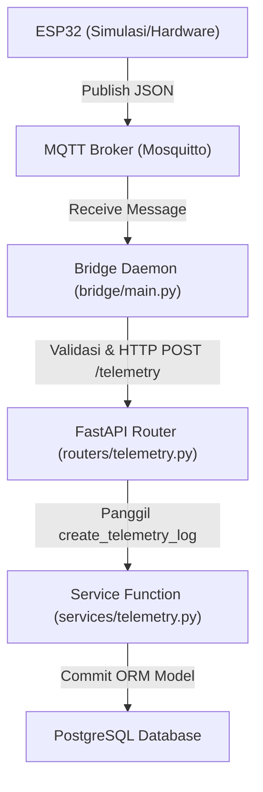

```mermaid
graph TD
    ESP["ESP32 (Simulasi/Hardware)"]
    Broker["MQTT Broker (Mosquitto)"]
    Bridge["Bridge Daemon (bridge/main.py)"]
    Router["FastAPI Router (routers/telemetry.py)"]
    Service["Service Function (services/telemetry.py)"]
    DB["PostgreSQL Database"]

    ESP -- Publish JSON --> Broker
    Broker -- Receive Message --> Bridge
    Bridge -- Validasi & HTTP POST /telemetry --> Router
    Router -- Panggil create_telemetry_log --> Service
    Service -- Commit ORM Model --> DB
```
